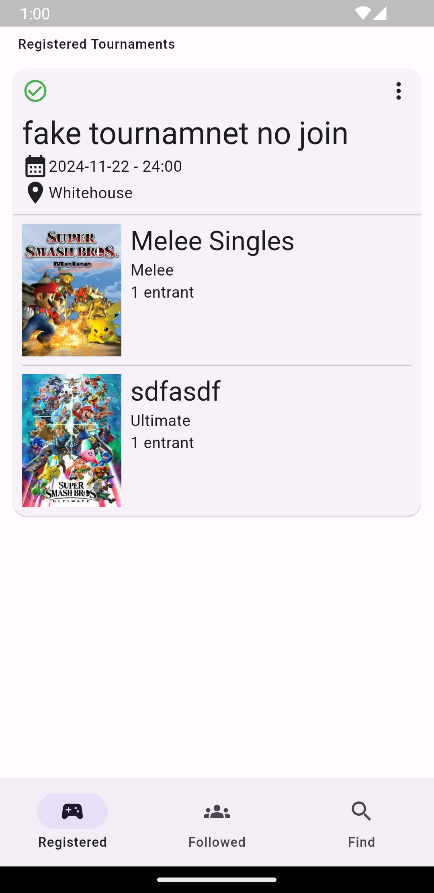
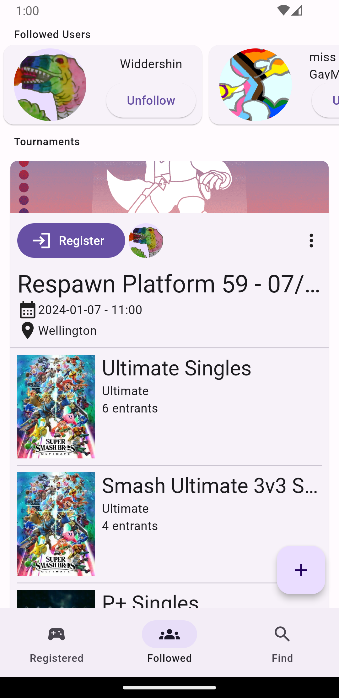

# StartMate
This is a cross-platform (Android and iOS) mobile application for interacting with [start.gg](https://www.start.gg/).

## Screenshots
<table>
  <tr>
    <td>Find featured tournaments</td>
    <td>Registered events</td>
    <td>Follow friends tournaments</td>
  </tr>
  <tr>
    <td></td>
    <td></td>
    <td></td>
  </tr>
</table>

## Development
You may want to run `dart run build_runner watch` while developing, as this will ensure that the Riverpod code is generated as you make changes.

## Icons
Application icons were generated from [icon.kitchen](https://icon.kitchen/i/H4sIAAAAAAAAA0VQvU7EMAx%2BF7N2KAdl6AoHKxK3IYTc2kkj0rhK00PodO%2BOnQqRIYk%2F%2B%2FtJLnDGuPEK%2FQUI89dp4pmhdxhXbmBA8lrB2wwNFGvRf8%2BffhZr%2BowUOBUdGfzLX6F6o0TJtzpx0909PD0fdaBCB4Oca1tyCmHyUWXuu2sDzj%2FGsGCu9JX1AGKHWzTxMEpSYJkk8ScmyhIIKukViULyRiqyQN81kIOflH5oNZSUIvN%2Bj%2BwqWmlH53gs%2BnTgyGcsrCaawCLuCW2Zwyy0Rfujd027%2B2ocWXX%2F5gE%2Brr95ITUiRgEAAA%3D%3D).
